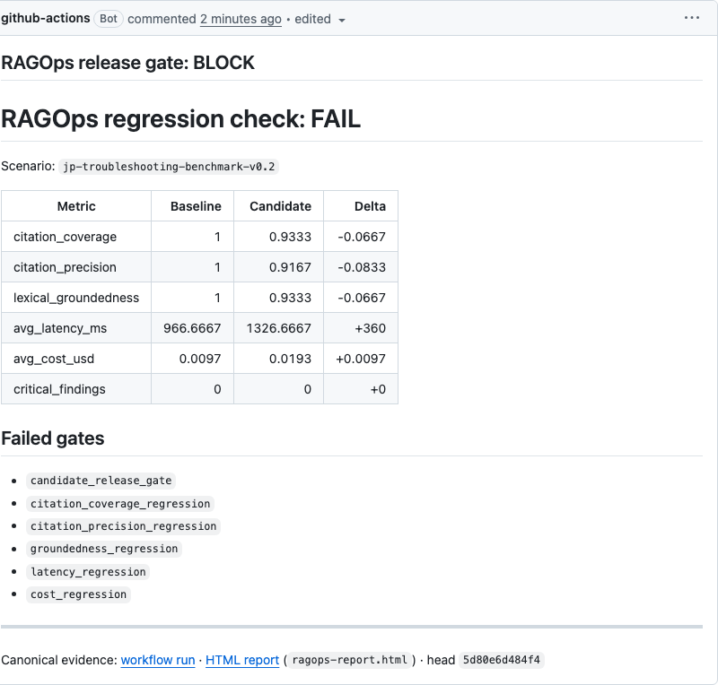

# Changelog

RAGOps follows [Semantic Versioning](https://semver.org/). Git history preserves
the engineering evolution before the reset public baseline.

## [Unreleased]

### Added

- Added a no-clone `uvx ragops demo` quickstart, a 45-second recorded demo, and
  a named RAG Failure Zoo covering permission leakage, stale evidence, wrong
  citations, prompt injection, failure to abstain, and excessive agency.
- Added downloadable HTML evidence to reusable GitHub gates and linked it from
  the bounded PR comment alongside metric deltas and named block reasons.
- Added an evidence-linked comparison with Ragas, DeepEval, Phoenix, and
  LangSmith.
- Added opt-in tagged evidence evaluators for exact current-source IDs and
  cited lexical abstention contracts, with explicit non-semantic boundaries.

### Changed

- Expanded the public showcase with the opt-in statistical regression workflow,
  repeated-run fixture evidence, sequential stopping, evaluator drift, signed
  baseline provenance, CI integration, and explicit uncertainty boundaries.
- Updated project status to record the completed `v1.0` GitHub Release,
  `1.0.0` PyPI publication, and the acceptance rule for the next milestone.
- Made the repository's own reusable RAGOps gate run on every pull request.

## [1.0.0] - 2026-07-15

### Added

- Added portable scenarios, traces, deterministic evaluators, comparison
  policies, machine-readable reports, CLI/API adapters, and offline PASS/BLOCK
  release decisions.
- Added an opt-in statistical regression path with versioned replay bundles,
  per-case repeated observations, paired hierarchical bootstrap bounds, effect
  sizes, and uncertainty-aware absolute and non-inferiority gates.
- Added bounded, shell-free repeated-run collection with atomic checkpoints,
  resume support, and predeclared sequential early stopping.
- Added evaluator-drift equivalence checks and provenance diagnosis for model,
  evaluator, dataset, infrastructure, and stochastic variance changes.
- Added content-addressed accepted-baseline manifests with optional detached SSH
  signing and offline verification.
- Added recorded-score bridges for Ragas, DeepEval, and OpenTelemetry GenAI
  evaluation events without provider dependencies in the core.
- Added authenticated bounded statistical API endpoints, reusable read-only
  GitHub gates, safe PR evidence publication, JSON Schemas, and reference
  PASS/BLOCK fixtures.

### Changed

- Reset the public product line to GitHub milestone `v1.0` and Python package
  `1.0.0`; superseded public release listings were removed by owner decision.
- Consolidated product, architecture, engineering, evaluation, showcase, and
  acceptance guidance around the current evidence-first workflow.

### Security

- Protected API endpoints fail closed without authentication, request and
  collection sizes are bounded, repeated commands never invoke a shell, and PR
  evaluation is isolated from trusted comment publication.
