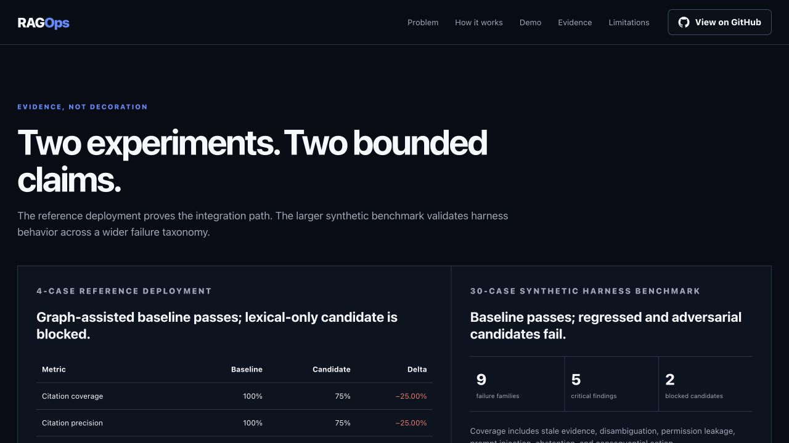
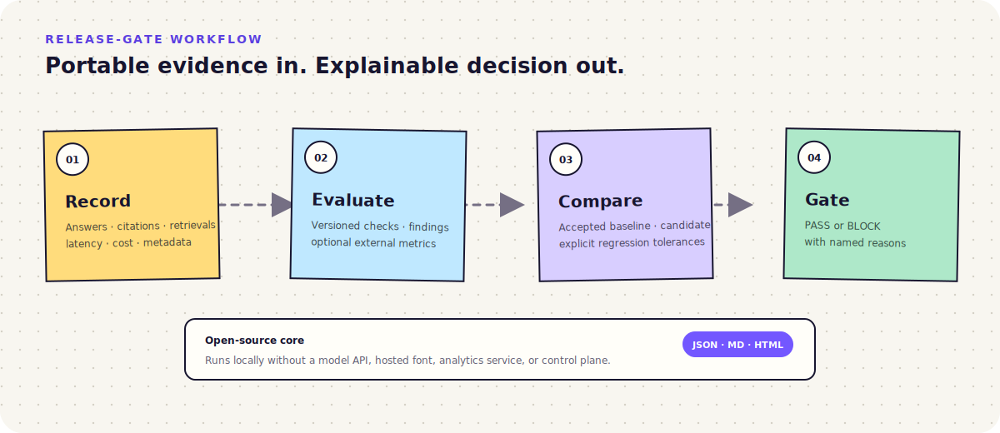
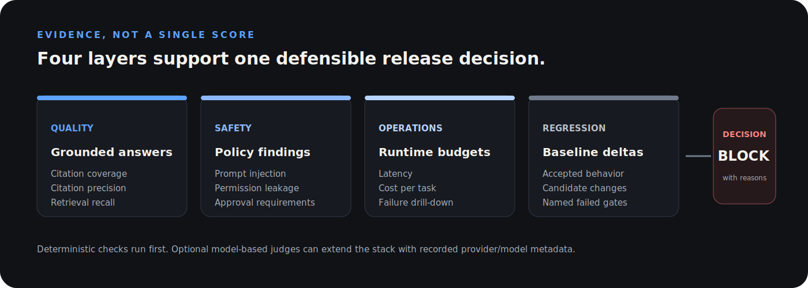
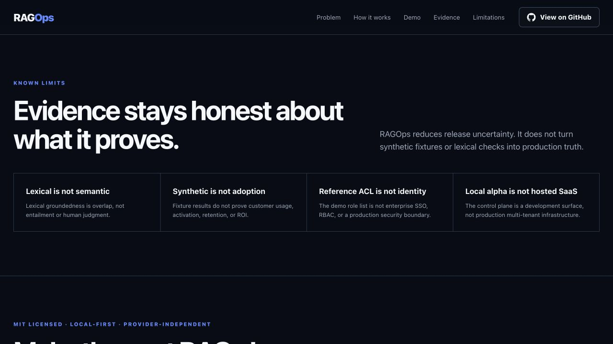
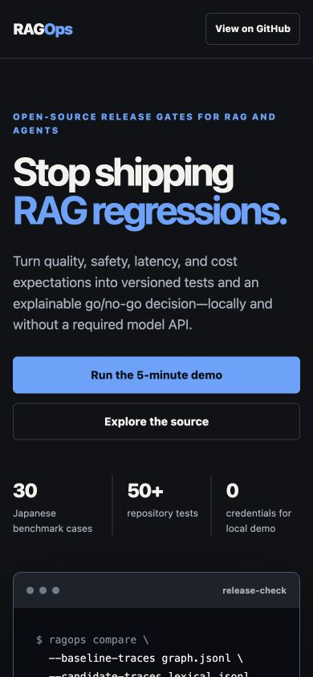

# RAGOps

**Evaluation and red-team release gates for RAG and agent systems.**

[](https://github.com/thangldw/ragops/actions/workflows/ci.yml)
[](https://pypi.org/project/ragops/)
[](pyproject.toml)
[](LICENSE)

RAGOps turns AI quality requirements into versioned scenarios, repeatable
checks, machine-readable reports, and defensible release decisions. The
dependency-free core runs locally; provider and hosted integrations remain
optional.

<p align="center">
  <a href="https://thangldw.github.io/ragops/">
    
  </a>
</p>

<p align="center">
  <a href="https://thangldw.github.io/ragops/"><strong>Product showcase</strong></a>
  ·
  <a href="examples/japanese_troubleshooting_agent/README.md"><strong>Reference deployment</strong></a>
  ·
  <a href="docs/evaluation/benchmark-report-v0.2.md"><strong>Benchmark evidence</strong></a>
</p>

## What RAGOps does

- Evaluates citations, groundedness, retrieval, latency, cost, and custom metrics.
- Runs deterministic red-team checks before optional model-based judges.
- Compares a candidate with an accepted baseline and blocks regressions.
- Exports JSON, Markdown, and standalone HTML evidence for review and CI.
- Supports Python, CLI, an optional FastAPI adapter, and portable JSONL traces.
- Keeps scenarios, policies, and reports versioned and provider-independent.
- Gates portable per-case metrics exported by Ragas, DeepEval, Langfuse, or
  internal judges without adding those frameworks to the core.

## How the release gate works

<p align="center">
  
</p>

RAGOps stays outside the application and model stack. It consumes portable
evidence, applies the same versioned contract to baseline and candidate, and
returns a decision with named reasons rather than an isolated dashboard score.

## Five-minute proof

Clone the repository and generate a complete, credential-free release bundle:

```bash
git clone https://github.com/thangldw/ragops.git
cd ragops
python -m venv .venv
source .venv/bin/activate
pip install -e .
ragops demo --output ragops-demo
```

For the latest published stable CLI without cloning the repository:

```bash
pip install ragops==2.0.0
ragops demo --output ragops-demo
```

Open `ragops-demo/release-report.html`. The accepted baseline passes; the
intentionally regressed candidate is blocked with named gates. The folder also
contains the portable scenario, baseline, candidate, and Markdown evidence.
The command refuses to reuse an existing output directory by default; pass
`--force` only when you intend to replace regular files in that directory.

Use the same workflow for a synthetic support-triage scenario:

```bash
ragops demo --scenario support-triage --output support-triage-demo
```

Or demonstrate an RFP/proposal requirement regression:

```bash
ragops demo --scenario proposal-review --output proposal-review-demo
```

## Evidence, not demo claims

The included Japanese enterprise reference deployment compares an ACL-first,
graph-assisted retrieval baseline with a lexical-only candidate under the same
questions and release contract.

| Recorded metric | Graph + ACL | Lexical only | Delta |
| --- | ---: | ---: | ---: |
| Citation coverage | 100% | 75% | -25.00% |
| Citation precision | 100% | 75% | -25.00% |
| Lexical groundedness | 100% | 78.12% | -21.88% |
| Release decision | Pass | **Block** | Hold release |

The synthetic fixture contains 30 Japanese questions across nine failure families,
including stale evidence, model disambiguation, permission leakage, prompt
injection, abstention, and consequential actions. These synthetic results
validate the harness and architecture comparison; they do not establish
Japanese semantic quality, customer adoption, or production ROI.

The repository currently validates its core, adapters, reference deployment,
showcase, and demo paths with 126 automated tests.

<p align="center">
  
</p>

## Main product screens

| Recorded release decision | Known limits and rollout recommendation |
| --- | --- |
|  |  |

<p align="center">
  
</p>

The screens show the public reference experience and recorded synthetic
evidence. They do not claim production security, customer adoption, or ROI.

## Evaluate your own fixtures

Requires Python 3.11+.

```bash
python -m venv .venv
source .venv/bin/activate
pip install -e '.[dev,api]'

ragops evaluate \
  --scenario scenarios/japanese_troubleshooting/benchmark-v0.2.json \
  --responses scenarios/japanese_troubleshooting/benchmark-baseline.json \
  --evaluator citation_correctness \
  --evaluator claim_support
```

Promote selected evaluator metrics or finding severities into release gates
with an explicit [evaluation policy](docs/evaluation/evaluator-gates.md). The
same evaluator and gate options are available on `evaluate` and `compare`.

Already use another evaluator stack? Export per-case results through the
[portable external metric envelope](docs/engineering/provider-adapters.md#external-evaluator-metrics)
and gate namespaced scores without installing that framework into RAGOps.

Add a deterministic Unicode code-point budget when response length matters:

```bash
ragops evaluate \
  --scenario scenarios/japanese_troubleshooting/scenario.json \
  --responses scenarios/japanese_troubleshooting/sample_responses.json \
  --evaluator answer_length_budget \
  --answer-length-limit 500
```

Run the credential-free reference deployment:

```bash
PYTHONPATH=src:. python -m examples.japanese_troubleshooting_agent.cli \
  --suite examples/japanese_troubleshooting_agent/suite.json \
  --retriever graph \
  --output /tmp/graph-traces.jsonl

ragops evaluate \
  --scenario examples/japanese_troubleshooting_agent/scenario.json \
  --traces /tmp/graph-traces.jsonl \
  --evaluator citation_correctness \
  --evaluator claim_support
```

### Measure a design-partner pilot (development preview)

The `main` branch includes a portable pilot evidence contract. Rehearse it with
synthetic data before collecting consented, pseudonymous partner observations:

```bash
ragops pilot-report \
  --manifest docs/gtm/pilot-fixtures/synthetic-manifest.json \
  --observations docs/gtm/pilot-fixtures/synthetic-observations.jsonl \
  --economics docs/gtm/pilot-fixtures/synthetic-economics.json \
  --output pilot-report.md
```

See the [pilot runbook](docs/gtm/design-partner-pilot-runbook.md) and
[synthetic report](docs/gtm/synthetic-pilot-report.md). Synthetic results are
examples only and are not customer adoption or ROI claims.

## Architecture

```text
RAG / agent application
        │ portable traces
        ▼
Scenario loader → deterministic checks → evaluator plugins
        │                                      │
        └──────── evidence + policy ────────────┘
                           │
                           ▼
             report → baseline comparison → release gate
```

```text
src/ragops/    Dependency-free evaluation core
apps/          Optional API and browser adapters
scenarios/     Portable fixtures, policies, and expected evidence
examples/      Reference deployments outside the core
schemas/       Public JSON Schema contracts
docs/          Product, architecture, evaluation, and project evidence
```

## Design principles

1. Evaluation is a release contract, not dashboard decoration.
2. Deterministic checks run before model-based judges.
3. Every score traces back to a case, evidence set, and policy version.
4. The open-source core remains valuable without a hosted service.
5. Agents recommend consequential actions; humans approve them.

## What RAGOps is—and is not

| RAGOps provides | RAGOps does not claim |
| --- | --- |
| Local, repeatable release evidence | Semantic correctness from lexical overlap |
| Portable scenarios, traces, and reports | Proof of production security or compliance |
| Baseline-aware regression gates | Customer adoption or business ROI |
| Extensible deterministic evaluators | A production multi-tenant hosted control plane |

The reference ACL is a role-list simulation and its graph is explicit and
small. See the [showcase limitations](https://thangldw.github.io/ragops/#limits)
before adapting the example to production.

## Documentation

- [Getting started](docs/getting-started.md)
- [Product thesis](docs/product/product_thesis.md)
- [System architecture](docs/architecture/system-overview.md)
- [Evaluation strategy](docs/evaluation/strategy.md)
- [Answer-length budget evaluator](docs/evaluation/answer-length-budget.md)
- [Reusable GitHub PR gate](docs/engineering/github-pr-gate.md)
- [GitLab CI release gate](docs/engineering/gitlab-ci-gate.md)
- [Safe PR-comment publishing design](docs/architecture/pr-comment-publishing.md)
- [Export your first portable trace](docs/engineering/export-your-first-trace.md)
- [OpenTelemetry span-to-trace example](examples/opentelemetry_trace_adapter/README.md)
- [PyPI Trusted Publishing runbook](docs/engineering/pypi-publishing.md)
- [Reference benchmark report](docs/evaluation/benchmark-report-v0.2.md)
- [Roadmap](docs/product/roadmap.md)
- [Contributing](CONTRIBUTING.md), [support](SUPPORT.md), and
  [security policy](SECURITY.md)

Optional provider integrations live outside the core. Local history and the
control-plane alpha are single-workspace development tools, not a production
multi-tenant service. See the
[control-plane limitations](docs/architecture/control-plane-alpha.md) before
adapting them for deployment.

## License

MIT. See [LICENSE](LICENSE). Previously published Apache-2.0 releases retain
their original license.
