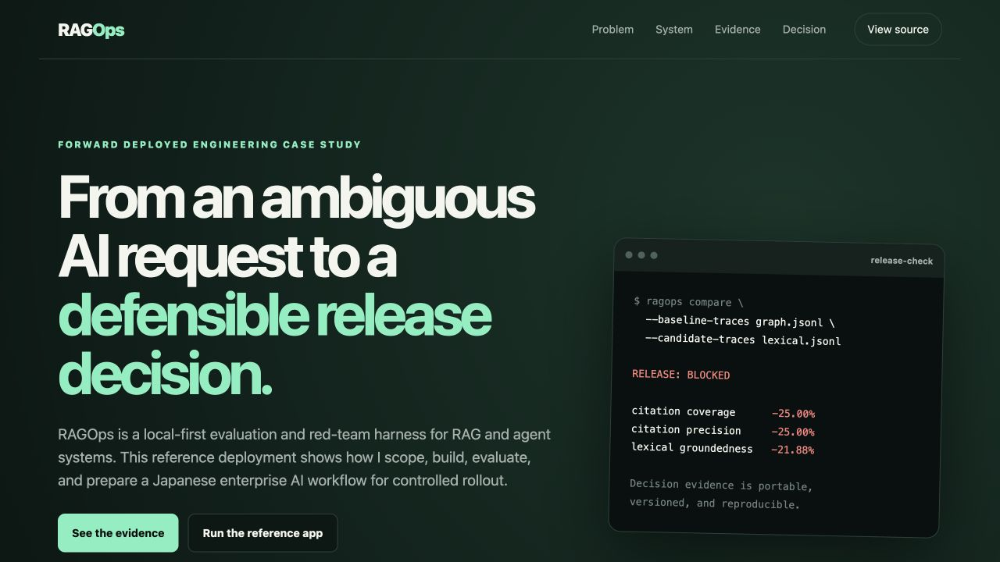

# RAGOps

**Evaluation and red-team release gates for RAG and agent systems.**

RAGOps turns AI quality requirements into versioned scenarios, repeatable
checks, machine-readable reports, and defensible release decisions. The
dependency-free core runs locally; provider and hosted integrations remain
optional.

<p align="center">
  <a href="https://thangldw.github.io/ragops/">
    
  </a>
</p>

<p align="center">
  <a href="https://thangldw.github.io/ragops/"><strong>Product showcase</strong></a>
  ·
  <a href="examples/japanese_troubleshooting_agent/README.md"><strong>Reference deployment</strong></a>
  ·
  <a href="docs/evaluation/benchmark-report-v0.2.md"><strong>Benchmark evidence</strong></a>
</p>

## What RAGOps does

- Evaluates citations, groundedness, retrieval, latency, cost, and custom metrics.
- Runs deterministic red-team checks before optional model-based judges.
- Compares a candidate with an accepted baseline and blocks regressions.
- Exports JSON, Markdown, and standalone HTML evidence for review and CI.
- Supports Python, CLI, an optional FastAPI adapter, and portable JSONL traces.
- Keeps scenarios, policies, and reports versioned and provider-independent.

## Evidence, not demo claims

The included Japanese enterprise reference deployment compares an ACL-first,
graph-assisted retrieval baseline with a lexical-only candidate under the same
questions and release contract.

| Recorded metric | Graph + ACL | Lexical only | Delta |
| --- | ---: | ---: | ---: |
| Citation coverage | 100% | 75% | -25.00% |
| Citation precision | 100% | 75% | -25.00% |
| Lexical groundedness | 100% | 78.12% | -21.88% |
| Release decision | Pass | **Block** | Hold release |

The benchmark contains 30 Japanese cases across nine failure families,
including stale evidence, model disambiguation, permission leakage, prompt
injection, abstention, and consequential actions. These synthetic results
validate the harness and architecture comparison; they do not claim customer
adoption or production ROI.

## Quick start

Requires Python 3.11+.

```bash
python -m venv .venv
source .venv/bin/activate
pip install -e '.[dev,api]'

ragops evaluate \
  --scenario scenarios/japanese_troubleshooting/benchmark-v0.2.json \
  --responses scenarios/japanese_troubleshooting/benchmark-baseline.json \
  --evaluator citation_correctness \
  --evaluator claim_support
```

Run the credential-free reference deployment:

```bash
PYTHONPATH=src:. python -m examples.japanese_troubleshooting_agent.cli \
  --suite examples/japanese_troubleshooting_agent/suite.json \
  --retriever graph \
  --output /tmp/graph-traces.jsonl

ragops evaluate \
  --scenario examples/japanese_troubleshooting_agent/scenario.json \
  --traces /tmp/graph-traces.jsonl \
  --evaluator citation_correctness \
  --evaluator claim_support
```

## Architecture

```text
RAG / agent application
        │ portable traces
        ▼
Scenario loader → deterministic checks → evaluator plugins
        │                                      │
        └──────── evidence + policy ────────────┘
                           │
                           ▼
             report → baseline comparison → release gate
```

```text
src/ragops/    Dependency-free evaluation core
apps/          Optional API and browser adapters
scenarios/     Portable fixtures, policies, and expected evidence
examples/      Reference deployments outside the core
schemas/       Public JSON Schema contracts
docs/          Product, architecture, evaluation, and project evidence
```

## Design principles

1. Evaluation is a release contract, not dashboard decoration.
2. Deterministic checks run before model-based judges.
3. Every score traces back to a case, evidence set, and policy version.
4. The open-source core remains valuable without a hosted service.
5. Agents recommend consequential actions; humans approve them.

## Documentation

- [Getting started](docs/getting-started.md)
- [Product thesis](docs/product/product_thesis.md)
- [System architecture](docs/architecture/system-overview.md)
- [Evaluation strategy](docs/evaluation/strategy.md)
- [Reference benchmark report](docs/evaluation/benchmark-report-v0.2.md)
- [Roadmap](docs/product/roadmap.md)
- [Contributing](CONTRIBUTING.md) and [security policy](SECURITY.md)

Optional provider integrations live outside the core. Local history and the
control-plane alpha are single-workspace development tools, not a production
multi-tenant service. See the
[control-plane limitations](docs/architecture/control-plane-alpha.md) before
adapting them for deployment.

## License

Apache-2.0. See [LICENSE](LICENSE).
