# RAGOps

**Regression tests and explainable release gates for RAG and AI agents.**

[](https://pypi.org/project/ragops/)
[](pyproject.toml)
[](LICENSE)

RAGOps answers one release question: after changing a prompt, retriever,
embedding model, dataset, or evaluator, is the candidate still good enough to
ship?

It compares recorded candidate behavior with an accepted baseline, applies a
versioned policy, and returns an explainable `PASS` or `BLOCK`. The core is
dependency-free, offline, and provider-independent.

<p align="center">
  <a href="https://thangldw.github.io/ragops/"><strong>Open the product showcase →</strong></a>
</p>

## Five-minute proof

```bash
python -m venv .venv
source .venv/bin/activate
pip install ragops==1.0.0
ragops demo --output ragops-demo
```

Open `ragops-demo/release-report.html`. The accepted baseline passes; the
intentionally regressed candidate is blocked with named reasons. The generated
bundle contains portable JSON, Markdown, and standalone HTML evidence and needs
no model API or hosted service.

Try the other credential-free scenarios:

```bash
ragops demo --scenario support-triage --output support-triage-demo
ragops demo --scenario proposal-review --output proposal-review-demo
```

## Release workflow

<p align="center">
  
</p>

1. **Record** responses or traces from the application you already operate.
2. **Evaluate** quality, safety, operational budgets, and optional external
   metrics against a versioned scenario and policy.
3. **Compare** the candidate with an accepted baseline using explicit
   tolerances or uncertainty-aware repeated-run bounds.
4. **Gate** the release with named reasons and case-level evidence.

RAGOps evaluates your system. It does not replace LangChain, LlamaIndex, your
model, retriever, observability stack, or application.

## What the core provides

- Citation coverage and precision, lexical groundedness, retrieval, latency,
  cost, answer-length, and red-team checks.
- Baseline-aware regression comparison with critical findings that fail closed.
- Fixed and predeclared sequential statistical gates for repeated metric
  observations, plus evaluator-drift and provenance diagnostics.
- Content-addressed accepted-baseline manifests with optional offline SSH
  signature verification.
- JSON, Markdown, and standalone HTML reports for local review and CI.
- Portable scenarios, response fixtures, JSONL traces, policies, and schemas.
- A Python API, CLI, evaluator plugins, and optional adapters outside the core.
- A provider-neutral envelope for scores exported by Ragas, DeepEval, Langfuse,
  or internal judges.

## Recorded evidence

The included Japanese troubleshooting reference deployment compares an
ACL-first, graph-assisted baseline with a lexical-only candidate under the same
four questions and release contract.

| Recorded metric | Graph + ACL | Lexical only | Delta |
| --- | ---: | ---: | ---: |
| Citation coverage | 100% | 75% | −25.00% |
| Citation precision | 100% | 75% | −25.00% |
| Lexical groundedness | 100% | 78.12% | −21.88% |
| Release decision | Pass | **Block** | Hold release |

The separate 30-case synthetic benchmark covers nine failure families,
including stale evidence, permission leakage, prompt injection, abstention, and
consequential actions.

<p align="center">
  
</p>

These fixtures validate the harness and the recorded architecture comparison.
They do not establish Japanese semantic quality, production security, customer
adoption, or ROI.

## Evaluate your own evidence

Requires Python 3.11 or newer.

```bash
python -m venv .venv
source .venv/bin/activate
pip install -e '.[dev,api]'

ragops evaluate \
  --scenario scenarios/japanese_troubleshooting/benchmark-v0.2.json \
  --responses scenarios/japanese_troubleshooting/benchmark-baseline.json \
  --evaluator citation_correctness \
  --evaluator claim_support
```

Compare a candidate with a baseline:

```bash
ragops compare \
  --scenario path/to/scenario.json \
  --baseline path/to/baseline.json \
  --candidate path/to/candidate.json \
  --evaluation-policy path/to/evaluation-policy.toml \
  --format html \
  --output release-report.html
```

- Exit `0`: evaluation completed and the candidate passes.
- Exit `2`: evaluation completed and policy blocks the candidate.
- Any other non-zero exit: invalid input, configuration, or contract.

Use `--traces` instead of `--responses` when your application exports portable
JSONL trace 0.4 records. Imported provider metrics keep the meaning defined by
their producer and your reviewed policy.

For repeated metric observations:

```bash
ragops compare-runs \
  --baseline-bundle scenarios/statistical_gate/baseline.json \
  --candidate-bundle scenarios/statistical_gate/candidate-pass.json \
  --policy scenarios/statistical_gate/policy.toml
```

The statistical path remains opt-in; deterministic evaluation contracts are
unchanged. See the [evaluation strategy](docs/evaluation/strategy.md) for
sampling units, sequential error control, drift isolation, and limitations.

## Architecture

```mermaid
%%{init: {"theme":"base","fontFamily":"system-ui, -apple-system, BlinkMacSystemFont, Segoe UI, sans-serif","flowchart":{"curve":"basis","htmlLabels":true},"themeVariables":{"background":"#f8f6f0","primaryColor":"#ffdc7c","primaryTextColor":"#17152f","primaryBorderColor":"#17152f","secondaryColor":"#bfe8ff","tertiaryColor":"#d8ceff","lineColor":"#756f84","edgeLabelBackground":"#fffef9","clusterBkg":"#fffef9","clusterBorder":"#b9b4aa"}}}%%
flowchart LR
    APP["RAG / AI agent<br/>existing application"]
    TRACE["Portable evidence<br/>responses · traces · metrics"]

    subgraph CORE["LOCAL OPEN-SOURCE CORE"]
        LOAD["Load<br/>scenario · policy"]
        CHECK["Evaluate<br/>checks · findings"]
        COMPARE["Compare<br/>baseline · candidate"]
        REPORT["Evidence<br/>JSON · Markdown · HTML"]
        LOAD --> CHECK --> COMPARE --> REPORT
    end

    GATE{"Release gate"}
    PASS["PASS<br/>continue"]
    BLOCK["BLOCK<br/>fix and re-run"]
    REVIEW["Engineer · CI · pull request"]

    APP -->|records| TRACE --> LOAD
    REPORT --> GATE
    GATE -->|meets policy| PASS
    GATE -->|named gates fail| BLOCK
    REPORT --> REVIEW

    classDef source fill:#bfe8ff,stroke:#17152f,color:#17152f,stroke-width:2px;
    classDef core fill:#ffdc7c,stroke:#17152f,color:#17152f,stroke-width:2px;
    classDef report fill:#d8ceff,stroke:#17152f,color:#17152f,stroke-width:2px;
    classDef pass fill:#aee8c9,stroke:#17152f,color:#17152f,stroke-width:2px;
    classDef block fill:#ffc0dd,stroke:#17152f,color:#8d2037,stroke-width:2px;

    class APP,TRACE source;
    class LOAD,CHECK,COMPARE core;
    class REPORT,GATE,REVIEW report;
    class PASS pass;
    class BLOCK block;
```



```text
src/ragops/    Dependency-free evaluation core
apps/          Optional API and browser adapters
scenarios/     Portable fixtures, policies, and expected evidence
examples/      Reference deployments outside the core
schemas/       Public JSON Schema contracts
docs/          Current guides and immutable project records
```

Solid arrows are the required offline path. Optional providers, external
evaluators, and hosted integrations remain adapters; the core can make a
complete release decision without them.

## Product boundary

| RAGOps provides | RAGOps does not claim |
| --- | --- |
| Local, repeatable release evidence | Semantic correctness from lexical overlap |
| Portable scenarios, traces, and reports | Proof of production security or compliance |
| Baseline-aware regression gates | Customer adoption or business ROI |
| Extensible deterministic evaluators | A production multi-tenant hosted service |

The reference ACL is a role-list simulation. The local control plane is a
single-workspace development surface. Consequential actions still require human
approval.

## Documentation

- [Documentation map](docs/README.md)
- [Getting started](docs/getting-started.md)
- [System architecture](docs/architecture/system-overview.md)
- [Evaluation strategy](docs/evaluation/strategy.md)
- [CI and pull-request gates](docs/engineering/ci-gates.md)
- [Trace, provider, and metric integrations](docs/engineering/integrations.md)
- [Testing and release workflow](docs/engineering/testing-and-release.md)
- [Reference benchmark](docs/evaluation/benchmark.md)
- [Contributing](CONTRIBUTING.md), [support](SUPPORT.md), and
  [security](SECURITY.md)

Git history and the changelog preserve released evolution. Repository HEAD keeps
one current source per topic so milestone snapshots are not mistaken for active
requirements.

## License

MIT. See [LICENSE](LICENSE). Previously published Apache-2.0 releases retain
their original license.
