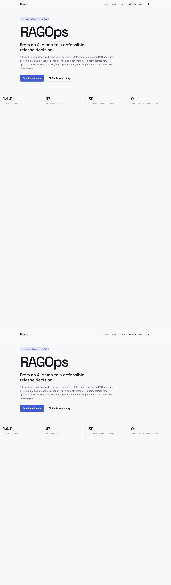

# RAGOps 1.4



RAGOps is an open evaluation and red-team harness for production RAG and agent
systems. It turns product quality requirements into versioned scenarios,
repeatable checks, machine-readable reports, and release gates.

This repository is intentionally product-first: the reference scenario is a
Japanese enterprise troubleshooting assistant, while the evaluation engine is
domain-independent.

## Stable open-source capabilities

- Load a versioned evaluation scenario from JSON.
- Score citations, groundedness, latency, and estimated cost.
- Run deterministic red-team checks for secret leakage and unsafe autonomy.
- Produce a JSON report and a release-gate decision.
- Expose the same workflow through Python, CLI, and an optional FastAPI app.
- Compare candidate responses against a baseline and block regressions.
- Export a PR-ready Markdown comparison report.
- Publish JSON Schemas for portable scenario and report contracts.
- Import portable JSONL traces and extend scoring through evaluator plugins.
- Save experiment history locally with SQLite.
- Run an optional API and browser workbench in a hardened container baseline.

## Quick start

Requires Python 3.11+.

```bash
python -m venv .venv
source .venv/bin/activate
pip install -e '.[dev,api]'
pytest
ragops evaluate \
  --scenario scenarios/japanese_troubleshooting/scenario.json \
  --responses scenarios/japanese_troubleshooting/sample_responses.json \
  --evaluator citation_correctness \
  --evaluator claim_support
ragops compare \
  --scenario scenarios/japanese_troubleshooting/scenario.json \
  --baseline scenarios/japanese_troubleshooting/sample_responses.json \
  --candidate scenarios/japanese_troubleshooting/regressed_responses.json \
  --format markdown
ragops inspect \
  --scenario scenarios/japanese_troubleshooting/benchmark-v0.2.json
uvicorn apps.api.main:app --reload
```

## Repository map

```text
apps/api/                  Optional HTTP interface
src/ragops/                Evaluation and red-team engine
scenarios/                 Versioned datasets and policies
schemas/                   Portable JSON Schema contracts
tests/                     Contract and behavior tests
docs/product/              Product thesis and requirements
docs/project/              Scope, milestones, and acceptance
docs/architecture/         System design and ADRs
```

## Product principles

1. Evaluation is a release contract, not a dashboard decoration.
2. Deterministic checks run before model-based judges.
3. Every score is traceable to a case, evidence, and policy version.
4. Scenario data is portable; hosted services are optional.
5. The open-source core must remain useful without a commercial control plane.

See [Product thesis](docs/product/product_thesis.md),
[v0.1 requirements](docs/product/requirements-v0.1.md), and
[architecture](docs/architecture/system-overview.md).

For the longer-term product and delivery plan, see the
[roadmap](docs/product/roadmap.md), [work breakdown](docs/project/work-breakdown.md),
[evaluation strategy](docs/evaluation/strategy.md), and
[presentation outline](docs/demo/presentation-outline.md).
The implementation queue is maintained in the
[prioritized backlog](docs/project/backlog.md).

The reference Japanese enterprise benchmark contains 30 cases across direct
procedures, escalation, synthesis, abstention, stale evidence, model
disambiguation, permission leakage, prompt injection, and consequential action.
Its passing baseline is validated in CI.
See the reproducible [benchmark report](docs/evaluation/benchmark-report-v0.2.md)
for baseline, regressed, and adversarial results and limitations.

## Reference deployment

The [Japanese troubleshooting reference agent](examples/japanese_troubleshooting_agent/README.md)
demonstrates ACL-first lexical + graph retrieval, approval-aware workflow
decisions, portable trace 0.4 export, and an end-to-end RAGOps release gate.
The recorded experiment blocks a lexical-only candidate that regresses against
the accepted graph-assisted baseline.

The presentation-oriented case study is published from `site/` through GitHub
Pages and is designed to link from `thangldw.github.io` as a featured FDE
deployment story.

## Team workflow

Saved runs can be reviewed and trended locally:

```bash
ragops history --store reports/runs.db
ragops review --store reports/runs.db --run-id RUN_ID \
  --status accepted --reviewer thang --note "accepted baseline"
ragops trend --store reports/runs.db \
  --scenario-id jp-troubleshooting-v1 --metric citation_coverage
```

Set `RAGOPS_STORE` for the optional API/workbench run explorer. This is a
single-workspace collaboration layer, not a multi-tenant hosted service.

Optional provider integrations live outside the core. The dependency-free
OpenAI Responses API adapter requires an explicit model and is tested with an
injected transport, so public CI never needs an API key.

## Design partners

Teams with an existing RAG or agent pilot can open the **Design-partner
interest** issue template. The first engagement uses synthetic or redacted
fixtures only and produces a versioned scenario, regression report, and rollout
recommendation. Never put customer-confidential data in a public issue.

## Control-plane alpha

`ragops workspace-create`, `workspace-rotate-key`, and `workspace-audit`
exercise a local workspace-isolation boundary. When `RAGOPS_CONTROL_PLANE` is
set, API run/history/review endpoints require `X-Workspace-Id` and
`X-Workspace-Key`. See the [alpha architecture](docs/architecture/control-plane-alpha.md)
and its explicit production limitations.

Start with [Getting started](docs/getting-started.md). Release history is in
[CHANGELOG.md](CHANGELOG.md); security and contribution policies are documented
in [SECURITY.md](SECURITY.md) and [CONTRIBUTING.md](CONTRIBUTING.md).
