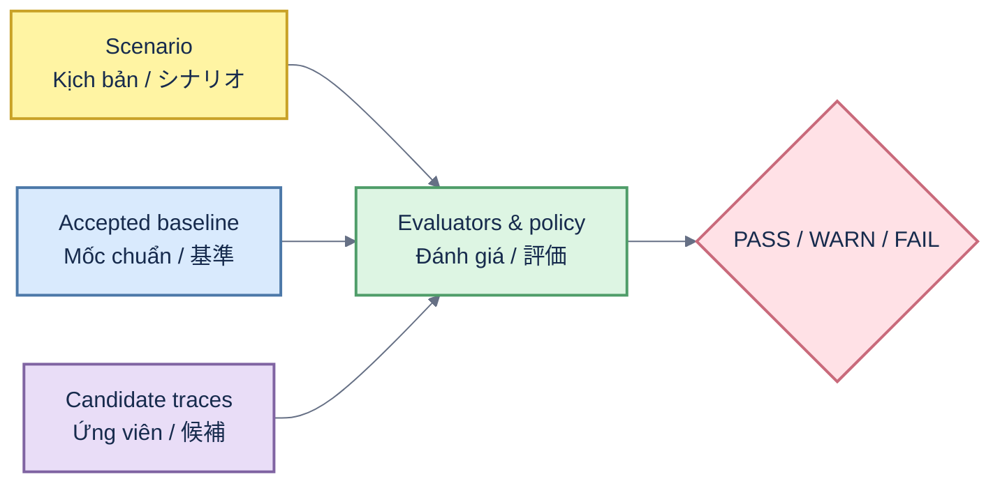

# RAGOps

[English](#english) · [Tiếng Việt](#tiếng-việt) · [日本語](#日本語)

Regression tests and explainable release gates for RAG systems and AI agents.


```mermaid
%%{init: {"theme":"base","themeVariables":{"background":"#FFFFFF","fontFamily":"Arial, sans-serif","lineColor":"#667085","primaryTextColor":"#172B4D"}}}%%
flowchart LR
    S["Scenario<br/>Kịch bản / シナリオ"]:::yellow
    B["Accepted baseline<br/>Mốc chuẩn / 基準"]:::blue
    C["Candidate traces<br/>Ứng viên / 候補"]:::purple
    E["Evaluators & policy<br/>Đánh giá / 評価"]:::green
    G{"PASS / WARN / FAIL"}:::pink
    S --> E
    B --> E
    C --> E --> G
    classDef yellow fill:#FFF4A3,stroke:#C9A227,stroke-width:2px,color:#172B4D
    classDef blue fill:#D9EAFD,stroke:#4C78A8,stroke-width:2px,color:#172B4D
    classDef purple fill:#E9DDF7,stroke:#8064A2,stroke-width:2px,color:#172B4D
    classDef green fill:#DDF5E3,stroke:#4F9D69,stroke-width:2px,color:#172B4D
    classDef pink fill:#FFE1E6,stroke:#C96A7B,stroke-width:2px,color:#172B4D
```

## English

RAGOps compares recorded candidate behavior with an accepted baseline, applies versioned release policy and returns explainable `PASS`, `WARN` or `FAIL` evidence. The dependency-free core works offline; optional adapters expose API and UI surfaces. Two reusable GitHub workflows remain because they are product interfaces and do not run on push or schedule.

Requirements: Python 3.11+.

Current technical references: [architecture](docs/ARCHITECTURE.md), [operations](docs/OPERATIONS.md), [security](SECURITY.md) and [v1.0.0 release notes](docs/releases/v1.0.0.md).

```bash
python -m venv .venv
.venv/bin/pip install -e '.[dev]'
.venv/bin/ragops inspect --scenario scenarios/japanese_troubleshooting/benchmark-v0.2.json
.venv/bin/ruff check .
PYTEST_DISABLE_PLUGIN_AUTOLOAD=1 .venv/bin/pytest -q
```

## Tiếng Việt

RAGOps so sánh hành vi ứng viên đã ghi lại với baseline được chấp nhận, áp dụng policy phát hành có version và trả về bằng chứng giải thích được ở trạng thái `PASS`, `WARN` hoặc `FAIL`. Core không có dependency và chạy offline; adapter tùy chọn cung cấp API/UI. Hai reusable workflow được giữ vì là giao diện sản phẩm và không tự chạy theo push hoặc lịch.

Yêu cầu: Python 3.11+. Dùng các lệnh ở phần English để cài đặt, kiểm tra scenario, lint và test.

## 日本語

RAGOps は、記録済みの候補動作を承認済みベースラインと比較し、バージョン管理されたリリースポリシーを適用して、説明可能な `PASS`・`WARN`・`FAIL` の根拠を返します。依存関係のないコアはオフラインで動作し、任意のアダプターが API と UI を提供します。残した2つの再利用可能ワークフローは製品インターフェースであり、push やスケジュールでは自動実行されません。

必要環境は Python 3.11 以上です。セットアップ、lint、テストには English セクションのコマンドを使用してください。

Released under the [MIT License](LICENSE).
