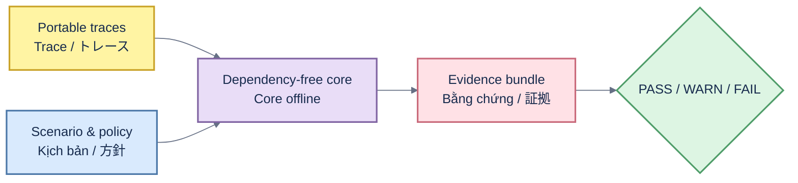

# RAGOps architecture / Kiến trúc / アーキテクチャ

## English

`src/ragops/` owns portable evaluation semantics, deterministic comparison and statistical gates. `scenarios/` and `schemas/` are versioned contracts. `apps/` contains optional API and GitHub adapters. Reusable workflows are read-only callers of the same core and publish bounded evidence artifacts.

## Tiếng Việt

`src/ragops/` quản lý evaluation portable, so sánh xác định và statistical gate. `scenarios/` cùng `schemas/` là contract có version. `apps/` chứa adapter API/GitHub tùy chọn. Reusable workflow chỉ đọc, gọi cùng core và xuất evidence artifact có giới hạn.

## 日本語

`src/ragops/` がポータブル評価、決定的比較、統計ゲートを担当します。`scenarios/` と `schemas/` はバージョン管理された契約です。`apps/` は任意の API・GitHub アダプターです。再利用可能 workflow は同じコアを読み取り専用で呼び出し、上限付き証拠を出力します。
