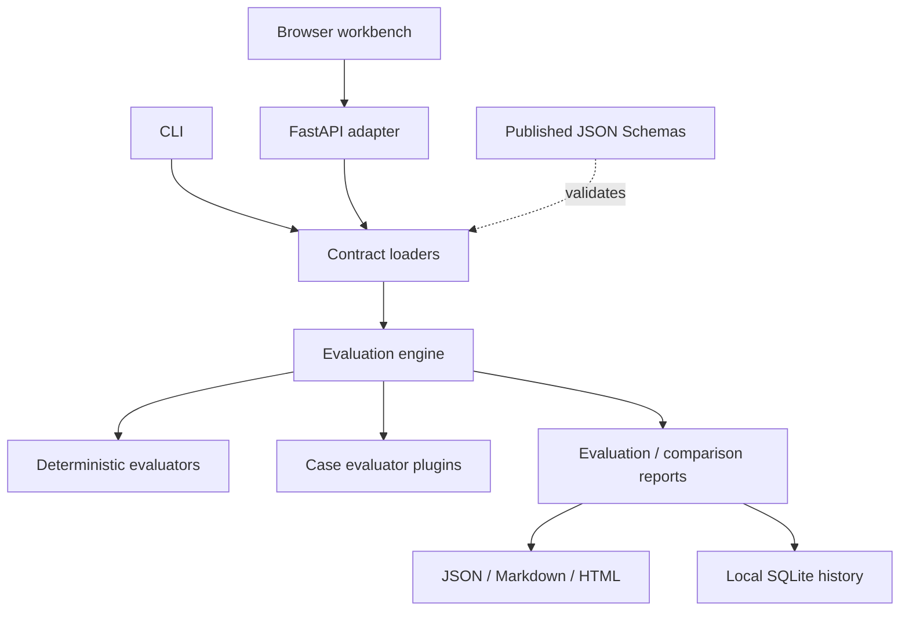

# Component architecture

## Dependency rule

Dependencies point inward toward models and engine semantics. Adapters may
depend on the core; the core must not depend on FastAPI, browser assets,
provider SDKs, or hosted infrastructure.

