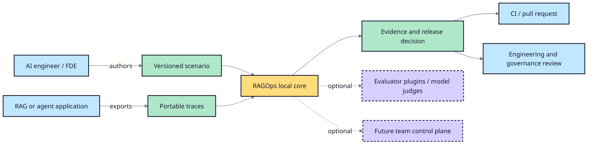

# System context

```mermaid
%%{init: {"theme":"base","fontFamily":"system-ui, -apple-system, BlinkMacSystemFont, Segoe UI, sans-serif","flowchart":{"curve":"basis"},"themeVariables":{"background":"#f8f6f0","primaryColor":"#ffdc7c","primaryTextColor":"#17152f","primaryBorderColor":"#17152f","secondaryColor":"#bfe8ff","tertiaryColor":"#d8ceff","lineColor":"#756f84","edgeLabelBackground":"#fffef9"}}}%%
flowchart LR
    Engineer["AI engineer / FDE"] -->|authors| Scenario["Versioned scenario"]
    Application["RAG or agent application"] -->|exports| Trace["Portable traces"]
    Scenario --> Core["RAGOps local core"]
    Trace --> Core
    Core --> Report["Evidence and release decision"]
    Report --> CI["CI / pull request"]
    Report --> Reviewer["Engineering and governance review"]
    Core -. optional .-> Plugin["Evaluator plugins / model judges"]
    Core -. optional .-> Hosted["Future team control plane"]
    classDef person fill:#bfe8ff,stroke:#17152f,color:#17152f,stroke-width:2px;
    classDef core fill:#ffdc7c,stroke:#17152f,color:#17152f,stroke-width:2px;
    classDef evidence fill:#aee8c9,stroke:#17152f,color:#17152f,stroke-width:2px;
    classDef optional fill:#d8ceff,stroke:#17152f,color:#17152f,stroke-width:2px,stroke-dasharray:5 4;
    class Engineer,Application,Reviewer,CI person;
    class Core core;
    class Scenario,Trace,Report evidence;
    class Plugin,Hosted optional;
```

RAGOps is never the system of record for enterprise knowledge and does not
execute business actions. It evaluates artifacts produced by another system.
