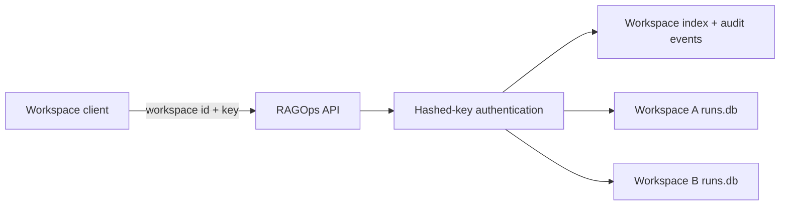

# Control-plane alpha architecture

## Implemented alpha controls

- Validated workspace slugs prevent path traversal.
- Random high-entropy keys are stored only as SHA-256 digests.
- Constant-time digest comparison and key rotation.
- Separate experiment database path for each workspace.
- Workspace creation, key rotation, store access, and audit events.
- API workspace headers select the authenticated store.

## Not production-ready

- SHA-256 is suitable here only because generated API keys have high entropy;
  human passwords require a password KDF.
- SQLite files do not provide production tenant isolation, HA, backups, or
  concurrent SaaS operations.
- Audit events are mutable by filesystem/database administrators.
- There is no SSO, RBAC, envelope encryption, rate limiting, billing, regional
  residency, queue, or incident-response integration.

Production commercialization requires a managed database with row-level tenant
policies, external identity, secrets management, immutable audit export, and an
independent security review.

