# Safe pull-request comment publishing design

## Trust boundary

```mermaid
%%{init: {"theme":"base","fontFamily":"system-ui, -apple-system, BlinkMacSystemFont, Segoe UI, sans-serif","flowchart":{"curve":"basis"},"themeVariables":{"background":"#f8f6f0","primaryColor":"#ffdc7c","primaryTextColor":"#17152f","primaryBorderColor":"#17152f","secondaryColor":"#bfe8ff","tertiaryColor":"#d8ceff","lineColor":"#756f84","edgeLabelBackground":"#fffef9"}}}%%
flowchart LR
    SOURCE["pull_request workflow<br/>read-only · untrusted code"]
    ARTIFACT["Bounded artifact<br/>Markdown · manifest · metadata"]
    VERIFY["workflow_run publisher<br/>default-branch code"]
    COMMENT["One idempotent comment<br/>canonical evidence links"]
    SOURCE -->|writes data only| ARTIFACT
    ARTIFACT -->|verify · parse · never execute| VERIFY
    VERIFY -->|pull-requests: write| COMMENT
    classDef source fill:#bfe8ff,stroke:#17152f,color:#17152f,stroke-width:2px;
    classDef evidence fill:#ffdc7c,stroke:#17152f,color:#17152f,stroke-width:2px;
    classDef control fill:#d8ceff,stroke:#17152f,color:#17152f,stroke-width:2px;
    classDef output fill:#aee8c9,stroke:#17152f,color:#17152f,stroke-width:2px;
    class SOURCE source;
    class ARTIFACT evidence;
    class VERIFY control;
    class COMMENT output;
```



## Evaluation workflow

- Trigger: `pull_request`, never `pull_request_target` for evaluation.
- Permissions: `contents: read` only.
- Secrets: none.
- Output: bounded UTF-8 Markdown report, command log, head SHA, and pull-request
  number.
- Artifact names and maximum sizes are fixed by trusted workflow code.

## Publisher workflow

- Trigger: `workflow_run` for the exact evaluation workflow name.
- Code source: default branch only; do not checkout the pull request.
- Permissions: `actions: read`, `contents: read`, `pull-requests: write`.
- Verify repository, source event, workflow ID/name, completion state, head SHA,
  pull-request association, artifact name, file count, and size before parsing.
- Treat artifact bytes, branch names, titles, and report content as untrusted data.
- Never source, execute, template into shell, or deserialize executable objects
  from the artifact.
- Render through a GitHub API request with values passed as data, not shell code.

## Idempotency

Use a stable marker such as:

```text
<!-- ragops-release-gate -->
```

List comments by the bot identity, find at most one marker comment, and update
it. Create a comment only when no marker exists. Reruns therefore replace stale
evidence instead of adding noise.

## Failure behavior

- Metadata mismatch, missing artifact, oversized evidence, or ambiguous PR
  association: publish nothing and fail the publisher job.
- Evaluation BLOCK: publish the BLOCK summary, then retain the original check
  failure as the release gate.
- API failure: do not weaken or reinterpret the evaluation result.

## Bounded enumeration and retention

- Artifact discovery accepts one complete response of at most 100 artifacts;
  a larger or incomplete collection fails closed.
- Comment discovery reads at most 1,000 comments; a full tenth page is treated
  as ambiguous and fails closed.
- Expired artifacts and GitHub API rate-limit responses publish nothing.
- Artifact retention follows the adopting repository's Actions settings.
  RAGOps updates one marker comment but does not automatically delete evidence
  or comments. See ADR 0021.

## Implemented controls

The publisher is implemented in `.github/workflows/ragops-pr-comment.yml` and
`apps/github_pr_comment.py`. Actions are pinned to full commit SHAs. The source
gate emits a bounded manifest, while the publisher validates the event,
artifact allowlist, sizes, manifest, conclusion, PR association, and comment
cardinality before writing through the GitHub JSON API.

The current read-only summary/artifact workflow remains the canonical release
gate. The comment is reviewer visibility only and cannot change PASS/BLOCK.
