# System overview

```mermaid
%%{init: {"theme":"base","fontFamily":"system-ui, -apple-system, BlinkMacSystemFont, Segoe UI, sans-serif","flowchart":{"curve":"basis"},"themeVariables":{"background":"#f8f6f0","primaryColor":"#ffdc7c","primaryTextColor":"#17152f","primaryBorderColor":"#17152f","secondaryColor":"#bfe8ff","tertiaryColor":"#d8ceff","lineColor":"#756f84","edgeLabelBackground":"#fffef9"}}}%%
flowchart LR
    SCENARIO["Scenario<br/>cases · thresholds"]
    EVIDENCE["Recorded evidence<br/>responses or traces"]
    LOADER["Load versioned<br/>contracts"]
    RUNNER["Evaluate<br/>quality · safety · budgets"]
    COMPARE["Compare<br/>baseline · candidate"]
    REPORT["Portable evidence<br/>JSON · Markdown · HTML"]
    GATE{"Release gate"}
    PASS["PASS"]
    BLOCK["BLOCK"]

    SCENARIO --> LOADER
    EVIDENCE --> LOADER
    LOADER --> RUNNER --> COMPARE --> REPORT --> GATE
    GATE --> PASS
    GATE --> BLOCK

    classDef input fill:#bfe8ff,stroke:#17152f,color:#17152f,stroke-width:2px;
    classDef core fill:#ffdc7c,stroke:#17152f,color:#17152f,stroke-width:2px;
    classDef evidence fill:#d8ceff,stroke:#17152f,color:#17152f,stroke-width:2px;
    classDef pass fill:#aee8c9,stroke:#17152f,color:#17152f,stroke-width:2px;
    classDef block fill:#ffc0dd,stroke:#17152f,color:#8d2037,stroke-width:2px;
    class SCENARIO,EVIDENCE input;
    class LOADER,RUNNER,COMPARE core;
    class REPORT,GATE evidence;
    class PASS pass;
    class BLOCK block;
```

The dependency-free Python core owns evaluation semantics. CLI, FastAPI,
browser, provider, and workflow integrations are adapters. Public scenario,
trace, response, metric, and report formats are explicitly versioned.

## Boundary decisions

- RAGOps evaluates a system; it does not own retrieval, generation, or business
  actions.
- Recorded responses and traces keep the required path reproducible and offline.
- Lexical groundedness is a transparent overlap baseline, not semantic
  correctness. Optional judge scores enter through adapters with recorded
  provenance.
- Critical policy findings override aggregate averages.
- A release report remains portable and reviewable without a hosted service.
