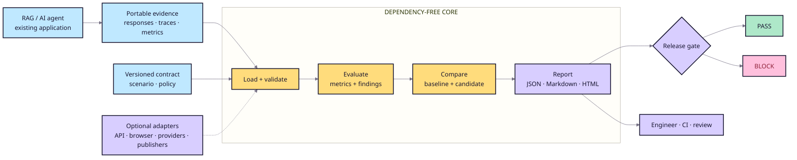

# System architecture

## Dependency rule

`src/ragops/` owns models, loaders, evaluation, comparison, findings, and
reports using only the Python standard library. `apps/`, providers, examples,
and workflows may depend on the core; the core never depends on them.

## Data model

- A **scenario** defines cases, expected evidence, thresholds, and policy.
- A **response** or **trace** records observed application behavior.
- A **replay bundle** records per-case, per-repeat metrics and complete
  comparison provenance.
- An **evaluation** contains per-case evidence, aggregate metrics, findings, and
  an absolute decision.
- A **comparison** evaluates baseline and candidate under the same contract,
  calculates deltas, and applies regression tolerances.
- A **report** serializes the evidence and named gate reasons.
- An **accepted baseline manifest** binds exact bundle and policy bytes; an
  optional signing adapter establishes owner identity.

Public schemas are versioned. SQLite history and review metadata are local
operational state, not part of the portable evaluation contract.

## Boundaries

- RAGOps never becomes the knowledge source or action executor.
- Optional provider metrics enter through stable adapters with explicit
  provenance and meaning.
- The required path stays offline and makes a complete release decision without
  a hosted service.
- Consequential actions remain subject to human approval.
