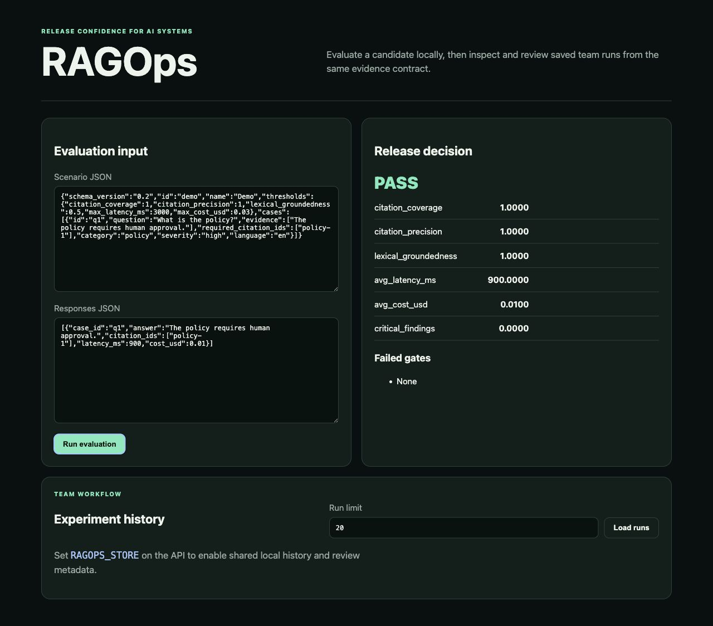
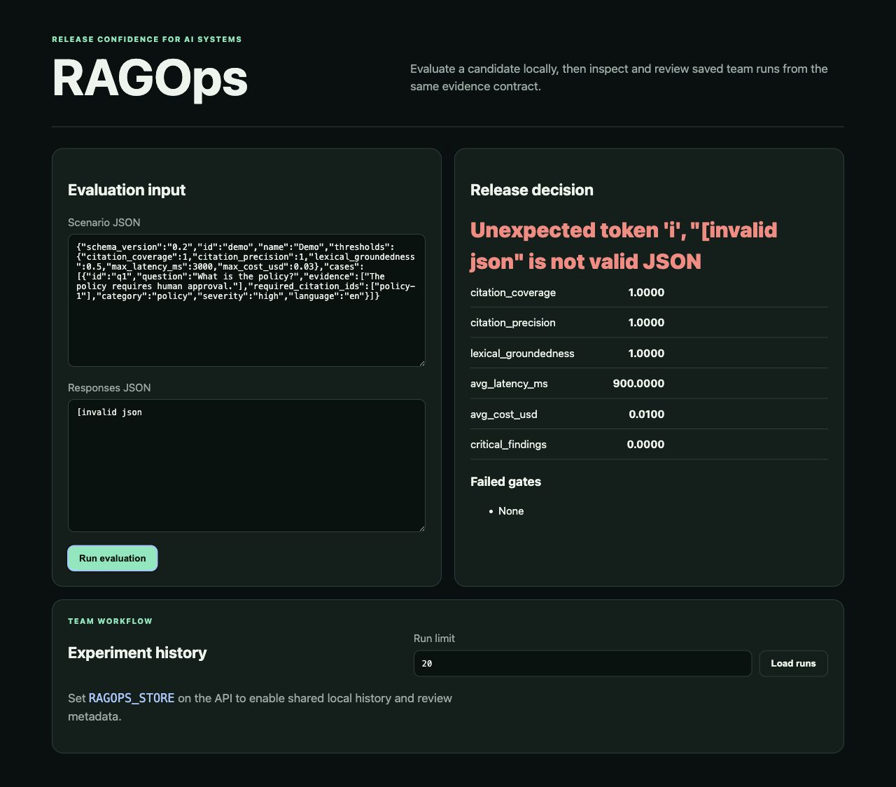
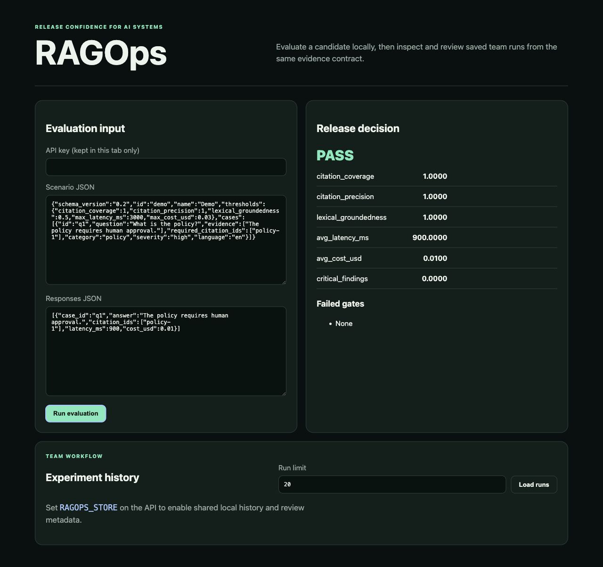
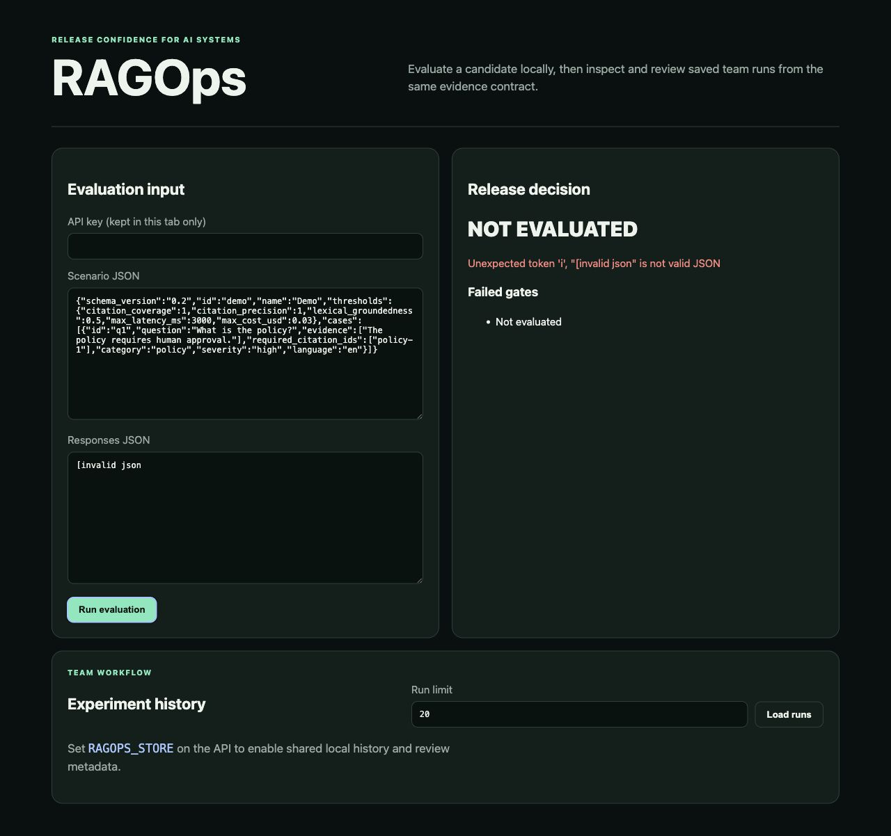

# RAGOps v1.9 workbench combined audit

## Audit scope

Local workbench flow at `http://127.0.0.1:8767/`: load the default fixture,
run an evaluation, then recover from invalid JSON. Captured in the Codex in-app
browser on 2026-07-13.

## User goal and accessibility target

A release owner should be able to enter portable evidence and distinguish a
valid PASS/BLOCK decision from an input or service error. The flow should expose
native labels, keyboard-reachable controls, and announced decision/error state.

## Numbered flow

1. **Default input — healthy.** Scenario and response inputs have native labels,
   the primary action is clear, and the decision panel starts without claiming
   a result.
2. **Successful evaluation — healthy.** PASS, metrics, and failed gates share
   one decision panel with a clear hierarchy.
3. **Invalid JSON before fix — unsafe.** The parse error replaced the status
   heading but left the previous PASS metrics and `Failed gates: None`, creating
   contradictory release evidence.
4. **Authenticated workbench after fix — healthy.** A password input lets the
   static workbench send the configured API key without persisting it in browser
   storage. Explicit insecure development mode can leave it blank.
5. **Invalid JSON after fix — healthy.** The state becomes `NOT EVALUATED`, the
   error is exposed as an alert, and prior metrics/gates are cleared.

## Evidence

### Step 2 — successful decision before remediation

### Step 3 — stale evidence defect

### Step 4 — authenticated successful decision

### Step 5 — corrected invalid-input state

## Strengths

- The two-column desktop layout keeps evidence entry and release decision in
  the same view.
- Native labels and controls make the basic reading and keyboard order clear.
- PASS color is paired with explicit status text; meaning does not depend on
  color alone.
- Metric names remain canonical report keys, supporting direct comparison with
  CLI/JSON evidence.

## UX and accessibility risks addressed

- **Resolved:** stale PASS evidence after a parse/API error.
- **Resolved:** authenticated API mode had no workbench credential path.
- **Resolved:** dynamic decision status now uses `aria-live="polite"`; error
  detail uses `role="alert"`.
- **Remaining:** raw JSON is appropriate for an alpha engineering workbench but
  lacks line/column highlighting and schema-aware guidance.
- **Remaining:** metric labels expose internal snake_case names. This preserves
  contract traceability but is slower to scan than a paired human label.
- **Remaining:** the history list has no column headers and its review actions
  are not available in this screen.

## Evidence limits

Screenshots and DOM snapshots confirm visible hierarchy, labels, and announced
roles. They do not establish full WCAG compliance, screen-reader output quality,
contrast ratios, keyboard focus visibility across every control, zoom behavior,
or mobile reflow. Those require separate assistive-technology and responsive
interaction testing.

## Recommendations

1. Keep the decision panel mutually exclusive: result, not-evaluated error, or
   waiting state; never mix evidence across them.
2. Add schema-aware JSON diagnostics before adding more dashboard chrome.
3. Pair canonical metric keys with concise human labels while retaining the key
   in secondary text or report export.
4. Treat experiment history as a separate follow-up flow with headers, empty
   state, and explicit review actions.
