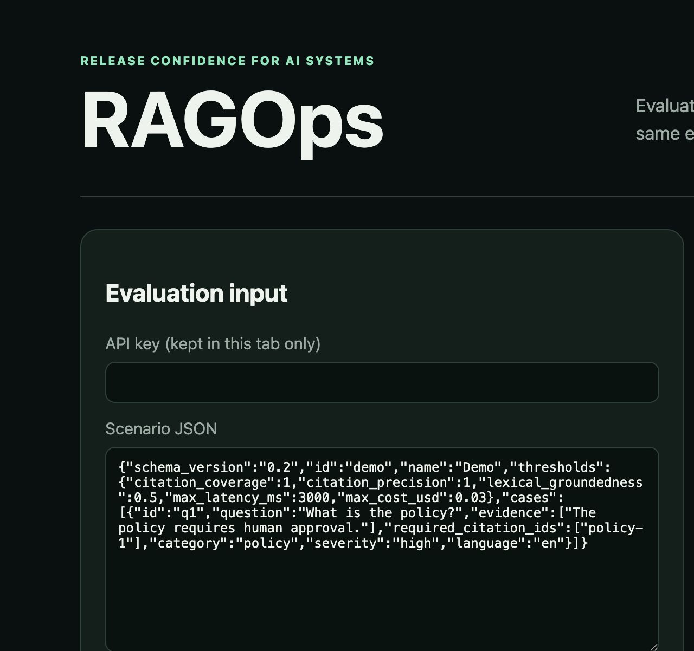

# v2.3 workbench product-flow audit

## Flow

1. **Evaluation input — healthy.** API key is explicitly tab-local; scenario and
   response fixtures are prefilled and labeled.
2. **Release decision — healthy empty state.** Before evaluation the UI says
   “Waiting for a run” and “Not evaluated”; it does not display stale PASS data.
3. **Experiment history — healthy with setup guidance.** The run limit is labeled
   and the page explains the `RAGOPS_STORE` requirement.

## Highest-impact follow-up

No release-blocking redesign is justified. A future usability study should test
whether adopters prefer file upload over large JSON textareas; screenshots alone
cannot establish this. Keyboard behavior, screen-reader announcements, focus
movement after evaluation, and color contrast require dedicated accessibility
testing and are not claimed here.

