# CI release gates

## GitHub pull requests

The reusable workflow is an adapter around the existing CLI:

```yaml
jobs:
  ragops:
    uses: thangldw/ragops/.github/workflows/ragops-gate.yml@v1.0
    with:
      scenario: scenarios/release.json
      baseline: scenarios/baseline.json
      candidate: scenarios/candidate.json
```

That is seven YAML lines. The caller owns fixtures and branch protection. The reusable workflow has
read-only repository permissions, preserves the CLI exit code, writes Markdown
to the Step Summary, and uploads Markdown plus standalone HTML evidence even
when the candidate is blocked.

## Statistical pull-request gate

Repeated metric bundles use the separate reusable statistical workflow:

```yaml
jobs:
  ragops-statistical:
    uses: thangldw/ragops/.github/workflows/ragops-statistical-gate.yml@<milestone-tag>
    with:
      mode: fixed # or sequential
      baseline-bundle: evals/baseline.bundle.json
      candidate-bundle: evals/candidate.bundle.json
      policy: evals/statistical-policy.toml
      baseline-manifest: evals/baseline-manifest.json
```

The manifest is optional during adoption but recommended for accepted
baselines. Supplying any SSH signature input requires the signature,
allowed-signers file, and signer identity together. The workflow verifies the
baseline before comparison, runs with `contents: read`, preserves exit `0` or
`2`, and publishes the same bounded artifact contract used by the isolated
default-branch PR-comment publisher.

## Safe pull-request comments

Evaluation and publication are separate trust boundaries:

```mermaid
%%{init: {"theme":"base","fontFamily":"system-ui, -apple-system, BlinkMacSystemFont, Segoe UI, sans-serif","flowchart":{"curve":"basis"},"themeVariables":{"background":"#f8f6f0","primaryColor":"#ffdc7c","primaryTextColor":"#17152f","primaryBorderColor":"#17152f","secondaryColor":"#bfe8ff","tertiaryColor":"#d8ceff","lineColor":"#756f84","edgeLabelBackground":"#fffef9"}}}%%
flowchart LR
    PR["Pull request<br/>untrusted code"]
    GATE["Read-only evaluation<br/>PASS or BLOCK"]
    ARTIFACT["Bounded evidence<br/>manifest + Markdown"]
    VERIFY["Default-branch publisher<br/>verify as data"]
    COMMENT["One marker comment<br/>canonical links"]
    PR --> GATE --> ARTIFACT --> VERIFY --> COMMENT
    classDef source fill:#bfe8ff,stroke:#17152f,color:#17152f,stroke-width:2px;
    classDef check fill:#ffdc7c,stroke:#17152f,color:#17152f,stroke-width:2px;
    classDef evidence fill:#d8ceff,stroke:#17152f,color:#17152f,stroke-width:2px;
    classDef output fill:#aee8c9,stroke:#17152f,color:#17152f,stroke-width:2px;
    class PR source;
    class GATE check;
    class ARTIFACT,VERIFY evidence;
    class COMMENT output;
```



The publisher uses `workflow_run`, `actions: read`, `contents: read`, and
`pull-requests: write`; it must never use `pull_request_target` to run fork code,
checkout the pull request, execute artifacts, or interpolate untrusted data into
shell commands. It updates the `<!-- ragops-release-gate -->` marker comment and
fails closed on ambiguous, expired, oversized, paginated, or rate-limited data.

The resulting PR comment includes the baseline/candidate metric table, named
block reasons, and an **HTML report** link to the workflow artifact section.
The two workflows are deliberately separate: contributors experience one
direct PR comment, while untrusted PR code never receives comment permission.

RAGOps uses this same path on its own repository. The
`ragops-gate-smoke.yml` caller runs on every pull request, installs the PR SHA,
and gates the passing reference fixture against the repository's own scenario.

Use the copyable [publisher recipe](../examples/github-pr-comment.yml) when the
adopting repository accepts this permission boundary.

## GitLab merge requests

The [GitLab recipe](../examples/gitlab-ci-ragops.yml) runs only for merge
requests, retains the gate exit code, and uploads the Markdown report and command
log with `when: always`.

## Exit behavior

- `0`: evaluation completed and the candidate passes.
- `2`: evaluation completed and policy blocks the candidate.
- Other non-zero: invalid input, configuration, installation, or contract.

Evidence publication improves visibility but never changes the release
decision.
