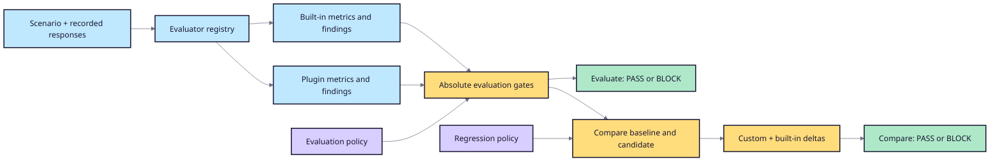

# Evaluator metrics as release gates

Custom evaluators remain diagnostic unless an evaluation policy explicitly
promotes their aggregate metrics or findings into release gates. This keeps
existing scenarios compatible and makes policy changes reviewable.



```toml
[metrics.claim_support]
minimum = 0.90

[metrics.citation_correctness]
minimum = 0.95

[findings]
fail_on_severity = "high"
```

Each metric must declare exactly one direction: `minimum` or `maximum`. Use the
canonical key shown in the JSON/Markdown report. Evaluators whose primary output
is `score` expose both the existing qualified key such as
`claim_support.score` and the concise alias `claim_support`; both values are
identical. Unknown or missing metrics fail closed.

Apply the same policy and evaluator set to an absolute evaluation:

```bash
ragops evaluate \
  --scenario scenarios/japanese_troubleshooting/benchmark-v0.2.json \
  --responses scenarios/japanese_troubleshooting/benchmark-baseline.json \
  --evaluator claim_support \
  --evaluator citation_correctness \
  --evaluation-policy scenarios/japanese_troubleshooting/evaluation-policy.toml
```

Or to both sides of a baseline comparison:

```bash
ragops compare \
  --scenario scenarios/japanese_troubleshooting/benchmark-v0.2.json \
  --baseline scenarios/japanese_troubleshooting/benchmark-baseline.json \
  --candidate scenarios/japanese_troubleshooting/benchmark-regressed.json \
  --evaluator claim_support \
  --evaluator citation_correctness \
  --evaluation-policy scenarios/japanese_troubleshooting/evaluation-policy.toml
```

The default finding floor remains `critical`. Setting `fail_on_severity` to
`high`, `medium`, or `low` also blocks every more severe finding. Regression
tolerances remain separate and continue to use `--policy`; the evaluation
policy controls absolute readiness for baseline and candidate.

These deterministic lexical evaluators do not prove semantic entailment. A
provider-backed evaluator must define its own reproducibility, calibration,
privacy, and availability guarantees before it becomes a release dependency.
