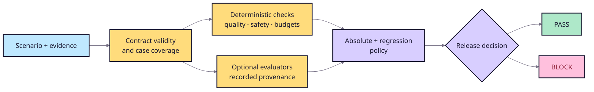

# Evaluation strategy

## Decision flow



The candidate must pass absolute thresholds and baseline regression tolerances.
Critical findings are non-compensating.

## Built-in and plugin evidence

- Citation coverage and precision check required and supplied citation IDs.
- Lexical groundedness measures transparent term overlap; it is not entailment.
- Retrieval, latency, and cost metrics connect behavior to operational policy.
- Red-team rules detect configured leakage, prompt-injection, approval, and
  excessive-agency failures.
- `citation_correctness` and `claim_support` add deterministic case evidence.
- `answer_length_budget` counts Python Unicode code points, including whitespace
  and punctuation, without normalization. Equal-to-limit passes; over-limit
  emits a medium diagnostic finding.

## Evaluation policy

Custom metrics remain diagnostic until policy declares one direction:

```toml
[metrics.claim_support]
minimum = 0.90

[metrics.citation_correctness]
minimum = 0.95

[findings]
fail_on_severity = "high"
```

Unknown or missing metrics, invalid directions, and non-finite values fail
closed. Evaluate and compare use the same evaluator set and absolute policy;
regression tolerances remain separate.

## Calibration and human review

Non-trivial evaluators need labeled cases, documented failure modes, and
agreement analysis against qualified reviewers. Provider-backed judges must
record model, prompt, and sampling configuration and be treated as uncertain
measurements, not ground truth.

## Red-team coverage

Attack families include injection, secret extraction, permission leakage,
retrieval poisoning, malicious citations, tool manipulation, excessive agency,
obfuscation, and multi-turn persistence. Use synthetic secrets and isolated
systems. Coverage and zero findings must never be described as proof of
security.
