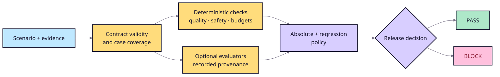

# Evaluation strategy

## Decision flow



The candidate must pass absolute thresholds and baseline regression tolerances.
Critical findings are non-compensating.

## Built-in and plugin evidence

- Citation coverage and precision check required and supplied citation IDs.
- Lexical groundedness measures transparent term overlap; it is not entailment.
- Retrieval, latency, and cost metrics connect behavior to operational policy.
- Red-team rules detect configured leakage, prompt-injection, approval, and
  excessive-agency failures.
- `citation_correctness` and `claim_support` add deterministic case evidence.
- `answer_length_budget` counts Python Unicode code points, including whitespace
  and punctuation, without normalization. Equal-to-limit passes; over-limit
  emits a medium diagnostic finding.

## Evaluation policy

Custom metrics remain diagnostic until policy declares one direction:

```toml
[metrics.claim_support]
minimum = 0.90

[metrics.citation_correctness]
minimum = 0.95

[findings]
fail_on_severity = "high"
```

Unknown or missing metrics, invalid directions, and non-finite values fail
closed. Evaluate and compare use the same evaluator set and absolute policy;
regression tolerances remain separate.

## Experimental statistical comparison

`ragops compare-runs` is an opt-in fixed-sample path for metrics recorded over
multiple runs. It does not change deterministic `evaluate` or `compare`
behavior. A replay bundle records one metric map per `(case_id, repeat_id)` plus
scenario digest and dataset, evaluator, application, model, configuration, and
environment provenance.

```toml
[statistical]
confidence = 0.95
minimum_cases = 30
resamples = 10000
seed = 20260715

[statistical.metrics.citation_precision]
direction = "higher"
minimum = 0.90
max_regression = 0.03
```

For a higher-is-better metric, the candidate passes only when its one-sided
lower bound meets `minimum` and the lower bound of candidate minus baseline is
at least `-max_regression`. Lower-is-better metrics use one-sided upper bounds,
`maximum`, and a positive regression margin. Cases are the outer resampling
unit; repeats are resampled within each selected case. Repeats therefore reduce
within-case uncertainty but never count as additional distinct cases.

The implementation uses per-metric confidence rather than a family-wide
multiple-testing guarantee. Ordinary fixed-sample bounds must not be repeatedly
inspected to implement early stopping.

### Sequential decisions

`ragops compare-sequential` evaluates only predeclared repeat-count looks. It
divides the total error budget across lower and upper boundaries, every planned
look, and every gated metric using a Bonferroni correction. It stops early when
all metrics have evidence for PASS or any metric has evidence of clear harm.
At the maximum repeat count, unresolved uncertainty blocks release.

`ragops collect-runs` can apply the same sequential policy while collecting a
candidate bundle. The command adapter receives `RAGOPS_CASE_ID` and
`RAGOPS_REPEAT_ID`, is invoked without a shell, checkpoints atomically after
each observation, and stops only after a complete repeat round reaches a
terminal decision.

### Evaluator drift and provenance diagnosis

`ragops detect-evaluator-drift` requires a frozen scenario, dataset, evidence,
application, model configuration, and environment. Only evaluator provenance
may change. A metric passes when its two-sided confidence interval remains
inside `±max_absolute_change`.

`ragops diagnose-provenance` classifies which recorded axes changed before an
engineer chooses a gate. Model, evaluator, dataset, and infrastructure changes
are distinct; multiple causal axes produce `confounded`. This diagnosis is
contract evidence, not automatic causal inference.

## Calibration and human review

Non-trivial evaluators need labeled cases, documented failure modes, and
agreement analysis against qualified reviewers. Provider-backed judges must
record model, prompt, and sampling configuration and be treated as uncertain
measurements, not ground truth.

## Red-team coverage

Attack families include injection, secret extraction, permission leakage,
retrieval poisoning, malicious citations, tool manipulation, excessive agency,
obfuscation, and multi-turn persistence. Use synthetic secrets and isolated
systems. Coverage and zero findings must never be described as proof of
security.
