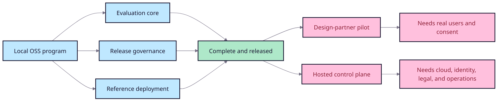

# RAGOps FDE program completion audit

## Outcome

The repository now implements the complete locally executable program defined
in the FDE blueprint: product strategy, open-source evaluation core, synthetic
Japanese-question release-gate fixture, red-team contracts, reference GraphRAG-style deployment,
portable observability evidence, team review workflow, control-plane alpha, and
public presentation assets.

## Milestone evidence

| Milestone | Status | Acceptance |
| --- | --- | --- |
| M0 stable local core | Complete | `docs/project/v1-acceptance.md` |
| M1 benchmark credibility | Complete | `docs/project/m1-acceptance.md` |
| M2 reference deployment | Complete | `docs/project/m2-acceptance.md` |
| M3 FDE showcase | Complete | `docs/project/m3-acceptance.md` |
| M4 local team workflow | Complete | `docs/project/m4-acceptance.md` |
| M5 commercial alpha boundary | Complete as local alpha | `docs/project/m5-acceptance.md` |
| v1.5 adoption-first experience | Released | `docs/project/v1.5-acceptance.md` |
| v1.6 pull-request adoption path | Released | `docs/project/v1.6-acceptance.md` |
| v1.7 broader adoption proof | Released | `docs/project/v1.7-acceptance.md` |
| v1.8 review visibility and measured adoption | Released | `docs/project/v1.8-acceptance.md` |
| v2.0 trustworthy extensible release gates | Released | `docs/project/v2.0-acceptance.md` |
| v2.1 portable external evaluator evidence | Released | `docs/project/v2.1-acceptance.md` |
| v2.2 quota-independent release | Released | `docs/project/v2.2-acceptance.md` |
| v2.3 release integrity | Released | `docs/project/v2.3-acceptance.md` |
| v2.4 adoption experience | Released | `docs/project/v2.4-acceptance.md` |

## FDE competency coverage

- **Discover:** ambiguous request, users, constraints, KPI hypothesis, scope.
- **Build:** ACL-first lexical+graph retrieval and controlled workflow agent.
- **Evaluate:** 30-case synthetic fixture, baseline/regression/adversarial candidates,
  citations, claim support, latency, cost, and critical policy gates.
- **Deploy:** Docker/API/CLI, CI/nightly workflows, portable traces, rollout plan.
- **Measure:** experiment history, trends, review decisions, release evidence.
- **Communicate:** ADRs, threat model, executive report, case-study site, demo
  walkthrough, and honest go/no-go recommendation.
- **Productize:** open-core boundary, commercialization hypothesis, workspace
  alpha, contribution/security guidance, GitHub release process, and PyPI OIDC
  distribution.

## Verification baseline

- Python 3.11+ dependency-free core.
- 140+ automated tests; the last CI matrix covered Python 3.11, 3.12, and 3.13,
  while v2.2+ release gates run locally during the Actions quota pause.
- GitHub/PyPI distributions through v2.4 are byte-identical. The v2.4 GitHub
  Release includes a reproducible CycloneDX SBOM, SHA-256 manifest, and local
  release evidence.
- Ruff and diff checks pass.
- Baseline and reference deployment pass; regressed/adversarial builds return
  expected release-blocking exit codes.
- Desktop and 390px mobile showcase layouts were browser-reviewed without
  horizontal overflow.

## Work that cannot be completed from source code alone

The following require owner authority, external systems, or real users and are
therefore launch activities rather than missing repository implementation:

1. Recruit design partners and replace synthetic fixtures with reviewed data.
2. Measure adoption, time-to-answer, escalation precision, and willingness to pay.
3. Establish legal/cloud/identity/billing/support/incident-response operations.
4. Complete independent security review before processing customer data.

## Final recommendation

Preserve `2.4.0` as the final stable release and keep active development paused
until the owner approves a concrete new user need. Keep the repository public
for adoption, feedback, issues, and Discussions. Any future design-partner pilot
or hosted control-plane work starts as a new scoped program; do not market the
control-plane alpha as production SaaS or claim measured ROI without external
evidence.
