# Japanese troubleshooting reference agent

This reference application demonstrates the M2 RAGOps integration boundary. It
is an offline, deterministic GraphRAG-style workflow—not a claim that rules are
a replacement for an LLM.

## Customer scenario

A Japanese manufacturer wants field engineers to resolve incidents faster
without leaking restricted notes or allowing an agent to take external action
without approval. Answers must cite approved manuals and policies.

## Pipeline

```mermaid
%%{init: {"theme":"base","fontFamily":"system-ui, -apple-system, BlinkMacSystemFont, Segoe UI, sans-serif","flowchart":{"curve":"basis"},"themeVariables":{"background":"#f8f6f0","primaryColor":"#ffdc7c","primaryTextColor":"#17152f","primaryBorderColor":"#17152f","secondaryColor":"#bfe8ff","tertiaryColor":"#d8ceff","lineColor":"#756f84","edgeLabelBackground":"#fffef9"}}}%%
flowchart LR
    INPUT["Question + role"] --> ACL["ACL filter"]
    ACL --> RETRIEVE["Lexical retrieval +<br/>entity graph expansion"]
    RETRIEVE --> RANK["Authority +<br/>intent ranking"]
    RANK --> DECIDE["Answer · clarify · escalate<br/>or request approval"]
    DECIDE --> TRACE["Portable trace 0.4"]
    TRACE --> GATE["RAGOps release gate"]
    classDef input fill:#bfe8ff,stroke:#17152f,color:#17152f,stroke-width:2px;
    classDef app fill:#ffdc7c,stroke:#17152f,color:#17152f,stroke-width:2px;
    classDef evidence fill:#d8ceff,stroke:#17152f,color:#17152f,stroke-width:2px;
    classDef output fill:#aee8c9,stroke:#17152f,color:#17152f,stroke-width:2px;
    class INPUT input;
    class ACL,RETRIEVE,RANK,DECIDE app;
    class TRACE evidence;
    class GATE output;
```



## Run

```bash
PYTHONPATH=src:. python -m examples.japanese_troubleshooting_agent.cli \
  "A1000 E-42 の一次対応は？" --role engineer

PYTHONPATH=src:. python -m examples.japanese_troubleshooting_agent.cli \
  --suite examples/japanese_troubleshooting_agent/suite.json \
  --retriever graph \
  --output /tmp/graph-traces.jsonl

PYTHONPATH=src python -m ragops.cli evaluate \
  --scenario examples/japanese_troubleshooting_agent/scenario.json \
  --traces /tmp/graph-traces.jsonl \
  --evaluator citation_correctness \
  --evaluator claim_support
```

## Recorded experiment

The graph+ACL build passes all four reference cases. The lexical-only candidate
is blocked with a 25-point citation coverage/precision regression and a
21.88-point lexical-groundedness regression. See `results/comparison.md`.

## Boundaries

- Synthetic data only.
- Deterministic evidence composition, no model/provider credential.
- ACL enforcement is role-list simulation, not production identity.
- Graph expansion is a small explicit graph, not automatic knowledge-graph
  extraction.
- Business-impact metrics are rollout hypotheses, not observed outcomes.
