# Japanese troubleshooting reference agent

This credential-free example shows how an application can enforce access
rules, assemble cited evidence, emit portable trace 0.4 records, and let RAGOps
make a deterministic release decision. It is a fixture for integration and
regression testing—not evidence of Japanese semantic quality or a replacement
for an LLM-based system.

## Workflow

```mermaid
%%{init: {"theme":"base","fontFamily":"system-ui, -apple-system, BlinkMacSystemFont, Segoe UI, sans-serif","flowchart":{"curve":"basis"},"themeVariables":{"background":"#f8f6f0","primaryColor":"#ffdc7c","primaryTextColor":"#17152f","primaryBorderColor":"#17152f","secondaryColor":"#bfe8ff","tertiaryColor":"#d8ceff","lineColor":"#756f84","edgeLabelBackground":"#fffef9"}}}%%
flowchart LR
    INPUT["Question + role"] --> ACL["Filter evidence<br/>by role"]
    ACL --> RETRIEVE["Retrieve lexically +<br/>expand explicit graph"]
    RETRIEVE --> DECIDE["Answer · clarify ·<br/>escalate · approve"]
    DECIDE --> TRACE["Write portable<br/>trace 0.4"]
    TRACE --> GATE["Evaluate release<br/>PASS or BLOCK"]
    classDef blue fill:#bfe8ff,stroke:#17152f,color:#17152f,stroke-width:2px;
    classDef yellow fill:#ffdc7c,stroke:#17152f,color:#17152f,stroke-width:2px;
    classDef purple fill:#d8ceff,stroke:#17152f,color:#17152f,stroke-width:2px;
    classDef green fill:#aee8c9,stroke:#17152f,color:#17152f,stroke-width:2px;
    class INPUT blue;
    class ACL,RETRIEVE,DECIDE yellow;
    class TRACE purple;
    class GATE green;
```



## Run

Ask one question:

```bash
PYTHONPATH=src:. python -m examples.japanese_troubleshooting_agent.cli \
  "A1000 E-42 の一次対応は？" --role engineer
```

Record the full graph-assisted suite and evaluate it:

```bash
PYTHONPATH=src:. python -m examples.japanese_troubleshooting_agent.cli \
  --suite examples/japanese_troubleshooting_agent/suite.json \
  --retriever graph \
  --output /tmp/graph-traces.jsonl

PYTHONPATH=src python -m ragops.cli evaluate \
  --scenario examples/japanese_troubleshooting_agent/scenario.json \
  --traces /tmp/graph-traces.jsonl \
  --evaluator citation_correctness \
  --evaluator claim_support
```

## Recorded decision

The graph-and-ACL fixture passes all four reference cases. The lexical-only
candidate is blocked by 25-point citation coverage and precision regressions
and a 21.88-point lexical-groundedness regression. The exact recorded metrics
are in [results/comparison.md](results/comparison.md).

## Production handoff

- Replace synthetic documents and role lists with governed sources and real
  identity checks.
- Export only the evidence fields required by the evaluation contract.
- Calibrate scenarios and thresholds with domain owners before enforcing a
  release gate.
- Keep retrieval, model execution, and external actions in the application;
  the dependency-free core evaluates recorded behavior.

## Limits

- Synthetic data and deterministic evidence composition only.
- Explicit graph expansion, not automatic knowledge-graph extraction.
- No model/provider credential and no production authorization claim.
- Business impact is unmeasured; this example proves only the release-gate
  integration boundary.
