# Reference architecture

```mermaid
%%{init: {"theme":"base","fontFamily":"system-ui, -apple-system, BlinkMacSystemFont, Segoe UI, sans-serif","flowchart":{"curve":"basis"},"themeVariables":{"background":"#f8f6f0","primaryColor":"#ffdc7c","primaryTextColor":"#17152f","primaryBorderColor":"#17152f","secondaryColor":"#bfe8ff","tertiaryColor":"#d8ceff","lineColor":"#756f84","edgeLabelBackground":"#fffef9"}}}%%
flowchart LR
    User["Field engineer"] --> Agent["Workflow agent"]
    Agent --> ACL["Role ACL filter"]
    ACL --> Lexical["Lexical retrieval"]
    ACL --> Graph["Entity graph expansion"]
    Lexical --> Rank["Authority + intent ranker"]
    Graph --> Rank
    Rank --> Decision["Answer / clarify / escalate / approval"]
    Decision --> Trace["Portable trace 0.4"]
    Trace --> RAGOps["RAGOps release gate"]
    classDef actor fill:#bfe8ff,stroke:#17152f,color:#17152f,stroke-width:2px;
    classDef app fill:#ffdc7c,stroke:#17152f,color:#17152f,stroke-width:2px;
    classDef evidence fill:#d8ceff,stroke:#17152f,color:#17152f,stroke-width:2px;
    classDef decision fill:#aee8c9,stroke:#17152f,color:#17152f,stroke-width:2px;
    class User actor;
    class Agent,ACL,Lexical,Graph,Rank app;
    class Decision decision;
    class Trace,RAGOps evidence;
```

The reference application owns retrieval and workflow behavior. RAGOps owns
evaluation contracts, evidence, comparison, and the release decision.

## Production substitutions

- Synthetic JSON documents -> governed enterprise connectors.
- Role lists -> SSO claims plus source-system ACL enforcement.
- Explicit graph -> versioned extraction pipeline and graph store.
- Deterministic composer -> provider adapter with structured output.
- Local JSONL -> OpenTelemetry/export queue with redaction and retention.
