# OpenTelemetry trace adapter

This dependency-free example converts already-exported and filtered
OpenTelemetry span JSONL into the portable RAGOps trace 0.4 envelope. It is an
adapter example—not an SDK, collector, or change to evaluation semantics.

## Data path

```mermaid
%%{init: {"theme":"base","fontFamily":"system-ui, -apple-system, BlinkMacSystemFont, Segoe UI, sans-serif","flowchart":{"curve":"basis"},"themeVariables":{"background":"#f8f6f0","primaryColor":"#bfe8ff","primaryTextColor":"#17152f","primaryBorderColor":"#17152f","secondaryColor":"#ffdc7c","tertiaryColor":"#d8ceff","lineColor":"#756f84","edgeLabelBackground":"#fffef9"}}}%%
flowchart LR
    APP["Application spans"] --> FILTER["Filter + redact"]
    FILTER --> ADAPTER["Example adapter"]
    ADAPTER --> TRACE["Portable trace 0.4"]
    TRACE --> CORE["RAGOps evaluation"]
    classDef blue fill:#bfe8ff,stroke:#17152f,color:#17152f,stroke-width:2px;
    classDef yellow fill:#ffdc7c,stroke:#17152f,color:#17152f,stroke-width:2px;
    classDef purple fill:#d8ceff,stroke:#17152f,color:#17152f,stroke-width:2px;
    classDef green fill:#aee8c9,stroke:#17152f,color:#17152f,stroke-width:2px;
    class APP blue;
    class FILTER yellow;
    class ADAPTER,TRACE purple;
    class CORE green;
```



## Run

```bash
PYTHONPATH=src python -m examples.opentelemetry_trace_adapter.adapter \
  --input examples/opentelemetry_trace_adapter/spans.jsonl \
  --output /tmp/ragops-otel-traces.jsonl

ragops evaluate \
  --scenario scenarios/japanese_troubleshooting/scenario.json \
  --traces /tmp/ragops-otel-traces.jsonl \
  --evaluator citation_correctness \
  --evaluator claim_support \
  --format markdown \
  --output /tmp/ragops-otel-report.md
```

The synthetic spans produce two evaluable traces without provider credentials.

## Mapping

| Span field or attribute | Trace 0.4 field | Required |
| --- | --- | --- |
| `ragops.case_id` | `case_id` | Yes |
| `gen_ai.prompt` | `input.question` | Yes |
| `gen_ai.response.text` | `output.answer` | Yes |
| `ragops.citation_ids` | `output.citation_ids` | No |
| `ragops.retrieved_document_ids` | `retrieval.document_ids` | No |
| timestamps or `duration_ms` | `latency_ms` | Yes |
| `ragops.cost_usd` | `usage.cost_usd` | No |
| `service.name`, `service.version` | trace metadata | No |

Export only attributes required for evaluation. Remove secrets, personal data,
unneeded prompt content, and sensitive source text before persisting fixtures
or uploading evidence artifacts.
